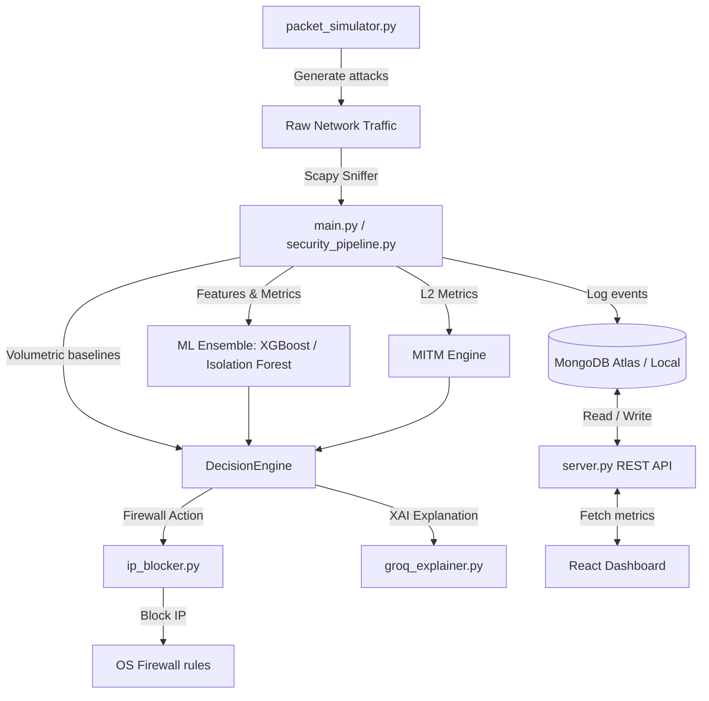

# 🛡️ Hybrid AI-IDS (Intrusion Detection System)

**Version 72.0** — A high-performance, flow-based security pipeline that integrates Layer-2 (ARP Spoofing, DNS Hijacking), Layer-4 (DDoS, SYN Floods, Port Scans), Layer-7 (WAF Injections, Slowloris), and Zero-Day anomaly detection in real-time, visualized through an interactive cyber-operations dashboard.

---

## 🏗️ System Architecture

The project is structured around a three-tier architecture that couples local packet capture with centralized database storage and a modern web frontend.



### 1. Web Frontend (`CS - new/frontend/`)
A Vite-powered React single-page application (SPA) featuring a dark-themed cyber-operations dashboard built with custom CSS utilities and interactive data charts (`recharts`).
*   **Overview page**: Visualizes threat levels, packet rates, active whitelists, and live logging.
*   **Pipeline page**: Shows detailed latency metrics across all 10 engine layers, flow buffer statistics, and cache usage.
*   **Management page**: Allows whitelisting, unblocking, and tracking malicious IPs.

### 2. Backend REST API (`CS - new/backend/`)
A Flask API backend that serves as the controller. It queries MongoDB and exposes HTTP endpoints for logs, statistics, user authentication, and system configs.

### 3. Sniffing & Detection Engine (`CS - new/engine/`)
The core network guardian. It captures packets using Scapy, processes them into 10-second flow batches, and routes them through a **10-Layer Flow-Based Security Pipeline**:
*   *Layer 1*: Flow Buffer Aggregation
*   *Layer 2*: Vectorized Feature Extraction
*   *Layer 3*: Behavioral & Stealth Scan Detection
*   *Layer 4*: ML Inference (XGBoost, Isolation Forest, Autoencoder)
*   *Layer 5*: Adversarial AI Attack Protection
*   *Layer 6*: Threat Intelligence Cached lookup
*   *Layer 7*: Multi-flow Event Correlation
*   *Layer 8*: Zero-Day Anomaly Detection
*   *Layer 9*: Volumetric & Metric Decision Fusion
*   *Layer 10*: Firewall Blocker & XAI Groq Explainer

---

## ⚡ Technical Stack

*   **Frontend**: React, Vite, React Router, Recharts, Custom HSL CSS.
*   **Backend**: Python, Flask, Flask-CORS, PyMongo.
*   **Core Engine**: Scapy, Pandas, Numpy, Scikit-Learn, XGBoost, Joblib.
*   **Database**: MongoDB (Local or Atlas Cloud).
*   **Explainable AI (XAI)**: Groq API client (`groq_explainer.py`).

---

## 🚀 How to Run the Project

### Prerequisites
1.  **Python 3.10+** must be installed.
2.  **Node.js (v18+)** must be installed.
3.  **MongoDB** must be active (the app defaults to `mongodb://localhost:27017/` if no `.env` file is present).
4.  **Npcap / WinPcap** (Windows only) must be installed to sniff live Layer-2 packet data. *(Download Npcap from [npcap.com](https://npcap.com/) and check the "WinPcap API-compatible mode" option during installation).*

---

### Step 1: Environment Setup

#### Setup Python Virtual Environment:
Open your terminal and navigate to the project directory:
```powershell
cd "CS - new"
python -m venv venv
.\venv\Scripts\Activate.ps1
pip install -r requirements.txt
```

#### Setup Node.js Packages:
Navigate to the frontend folder and install npm dependencies:
```powershell
cd frontend
npm install
```

---

### Step 2: Running the Services

To run the complete system, you need to launch three processes concurrently. Ensure your virtual environment is active in the terminals where you launch the Python scripts.

#### Terminal 1: Run the Backend REST API
Exposes the database metrics on port `5005`.
```powershell
cd "CS - new"
.\venv\Scripts\Activate.ps1
$env:PYTHONIOENCODING="utf-8"
python backend/server.py
```

#### Terminal 2: Run the Web Frontend Dashboard
Starts the Vite dev server on `http://localhost:5173`.
```powershell
cd "CS - new/frontend"
npm run dev
```

#### Terminal 3: Run the Sniffing Detection Engine
Starts sniffing interfaces and logging batches to the DB.
```powershell
cd "CS - new"
.\venv\Scripts\Activate.ps1
$env:PYTHONIOENCODING="utf-8"
python engine/main.py
```

---

### Step 3: Run the Attack Combat Simulator (Optional)

To test the detection capabilities of the pipeline, open a separate terminal and trigger one of the **14 simulated attack profiles** (DDoS, Port Scan, Slowloris, WAF Injections, etc.):
```powershell
cd "CS - new"
.\venv\Scripts\Activate.ps1
python engine/stimulater/packet_simulator.py
```
Use the interactive terminal menu to blast the target network interface with attacks and observe how the engine detects and blocks them on the dashboard.

---

## 🌟 V72 Dynamic Baseline Feature
Unlike legacy systems that block traffic based on static thresholds, the Version 72 engine maintains a running Exponential Moving Average (EMA) baseline of packet-per-second (PPS) rates for *each active IP*:

*   **CDN / Streaming Tolerance**: High-volume, clean connections naturally build up their baseline and are **allowed** without false-positive blocks.
*   **Spike Regulation**: Sudden volumetric surges that lack attack indicators (e.g. low TCP SYN ratio) degrade gracefully to a `THROTTLE` rate limit.
*   **Corroboration Gating**: Firewall blocks are strictly restricted to cases where high PPS rates are accompanied by malicious signatures, such as high TCP SYN ratios ($>20\%$) or high ML classification flags ($>0.7$).

---

## 🛠️ Troubleshooting

*   **Error: `RuntimeError: Sniffing and sending packets is not available at layer 2`**:
    *   *Cause*: Npcap is missing or not installed in WinPcap compatibility mode on Windows.
    *   *Fix*: Install/Reinstall [Npcap](https://npcap.com/) and make sure to select the "Install Npcap with WinPcap API-compatible mode" checkbox.
*   **Error: `UnicodeEncodeError` when running python scripts**:
    *   *Fix*: Prepend `$env:PYTHONIOENCODING="utf-8"` in PowerShell (or `export PYTHONIOENCODING=utf-8` in Linux/bash) before running the command to allow rendering of terminal status icons.
*   **Error: Dashboard shows `Connection Error` or fails to authenticate**:
    *   *Fix*: Ensure the Backend REST API is running on port `5005`. By default, Vite looks at `http://localhost:5005/api` for backend queries.
